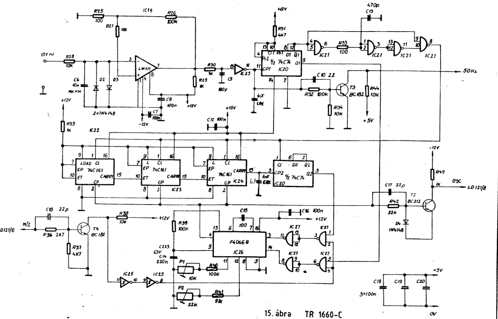

# HIKI TR-1660C 4.5 digit DMM repair
December 2024

## Initial condition
No display activity. Power supply rails operating, some electrolytics were preventively replaced. No data was sent from the in-guard region LD120 to the digital LD121. The reason was that the LD121 had no OSC clock signal.

## OSC clock signal

The A/D clock signal is generated by a PLL, locking its output to the mains 50Hz. The 50Hz square wave needed was correctly generated from one of the transformer taps, the most probable culprit was the PLL chip itself (IC26, F4046B). Breaking a trace and injecting a 162840Hz square wave into OSC, the display showed some (erroneous) readings. The PLL chip was replaced.

## Input range mismatch

The measured value changed substantially when the input range was changed. The reason was that R116 (10M 0.1%) in the input attenuation section was previously replaced by two 5.1M 10% resistors in series. With a new precision resistor sourced, the meter operates correctly after a thorough calibration.