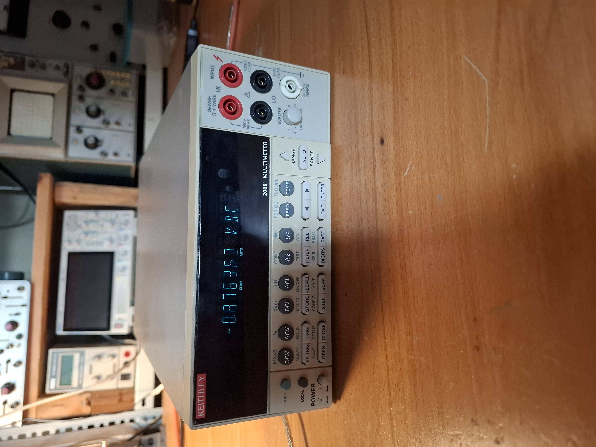
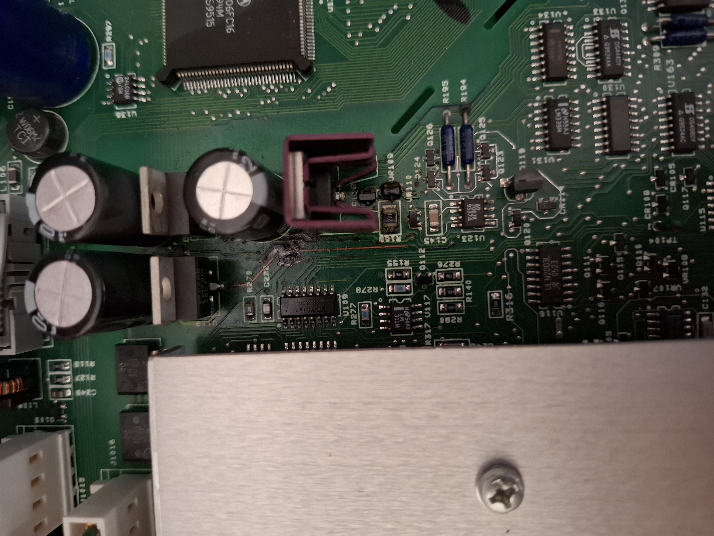
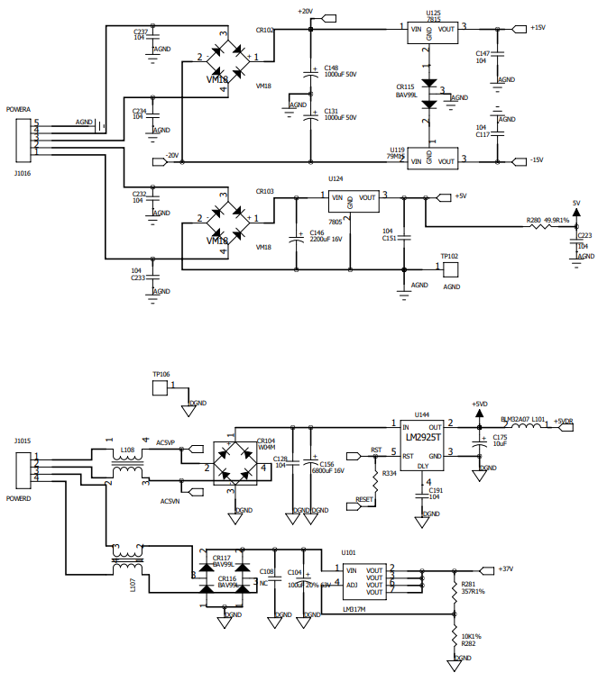
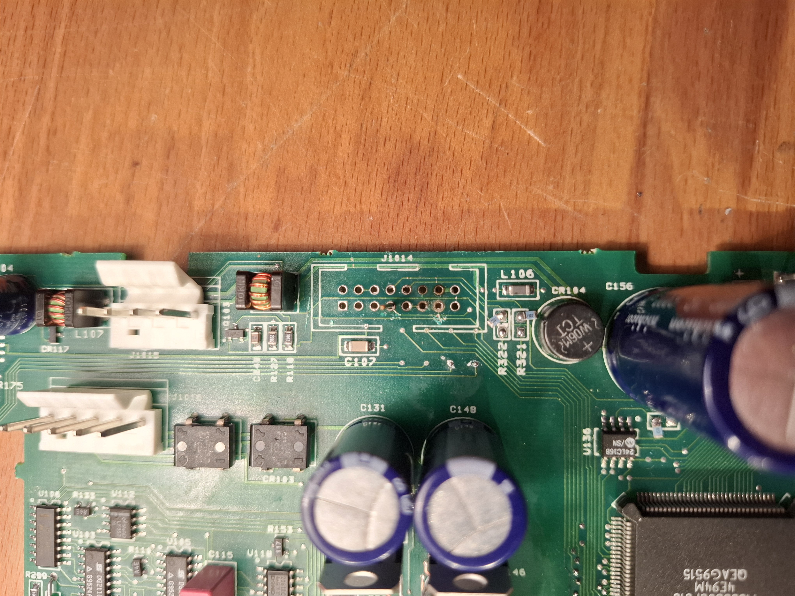
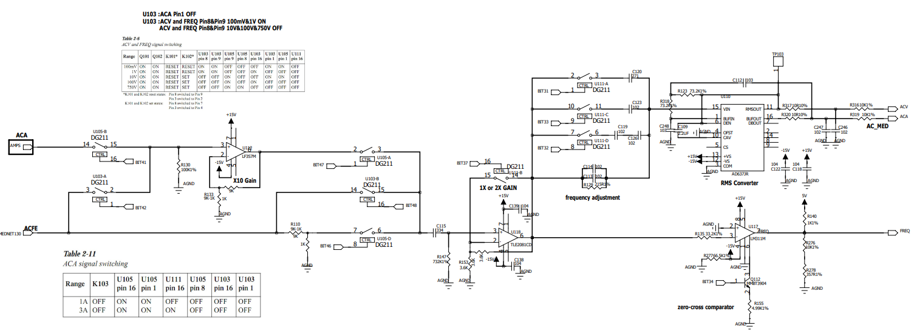

# Keithley 2000 6.5 digit DMM repair
July 2025

## Initial condition
Unit is intact, does not react to power. Upon inspection, power supply area shows severe corrosion.

## Power supply repair
All components were removed from the area to asses the extent of the damage. The filter electrolytics - specifically C146, sandwitched between the linear regulators' heat sinks - had leaked electrolyte all over the area, damaging traces, component legs and vias. The damage also effected some of the AC measurement circutry as well as the Ohms source.

All effected components were removed, the board was thorougly cleaned with IPA. The broken traces and vias were fixed with hookup wire. New components were placed back in.

The analog power supply's +5V, +15V and -15V rails were operating normally. Still no display activity or boot beep.

## Reset line
Instead of goind low on boot, then staying high, the reset line had the positive half of a 50Hz sine wave on it, preventing MCU boot. The 50Hz signal "AC5VP" originates from the secondary of the transformer used for the digital 5V supply. Inspecting the [schematics](https://xdevs.com/doc/Keithley/2000/K2000.pdf), the only place these two signals meet is at the display connector. Further investigation ruled out any interference before the connector. The connector was desoldered, and some signs of electrolyte corrosion were discovered below it, possibly bridging the reset line and AC5VP.

The are was cleaned with IPA and the connector was resoldered. The reset line operated normally, the MCU was able to boot, and readings were displayed on the VFD.

## Self-test errors
The instrument displayed a multitude of self-test errors in all test banks, from ADC to AMP/OHM. Most of these were eventually fixed after discovering some parts had one or more missing power rails.

## ACV offset
The last remaining self test error was due to a 20% offset in all ACV ranges. Since the offset was present in all ranges, the signal was traced back from the RMS converter towards the inputs. The offset disappeared before the C115 330n decoupling capacitor. The capacitor and the following op-amp U118 (TLE2081) was suspect, but the real culprit was the zero-cross comparator U117 (LM311), which was leaking out of its inverting input, adding an offset to the AC reading. 

## 10 channel scanner card
A 10 channel scaner card was fabricated for the unit based on [voltsandjolts's design](https://www.eevblog.com/forum/circuit-studio/example-project-relay-scan-card-for-k2000-dmm/).

