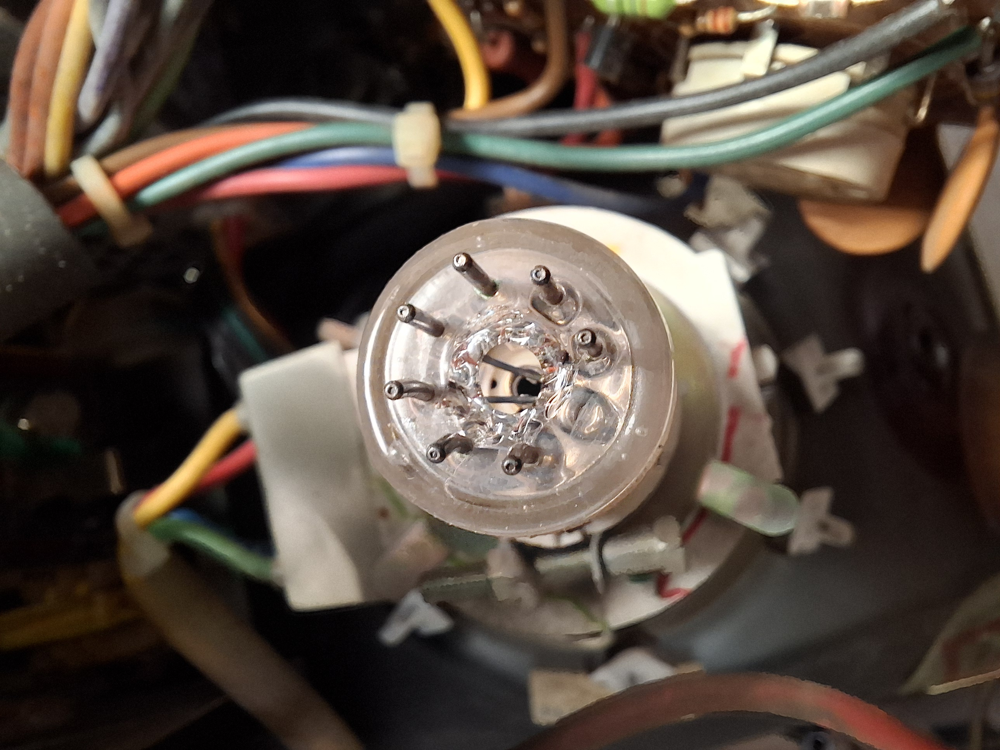
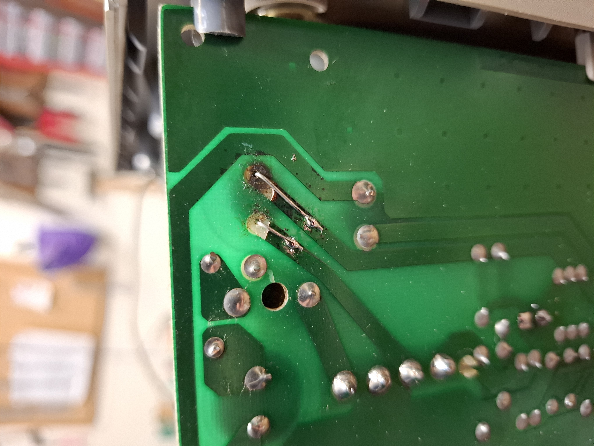
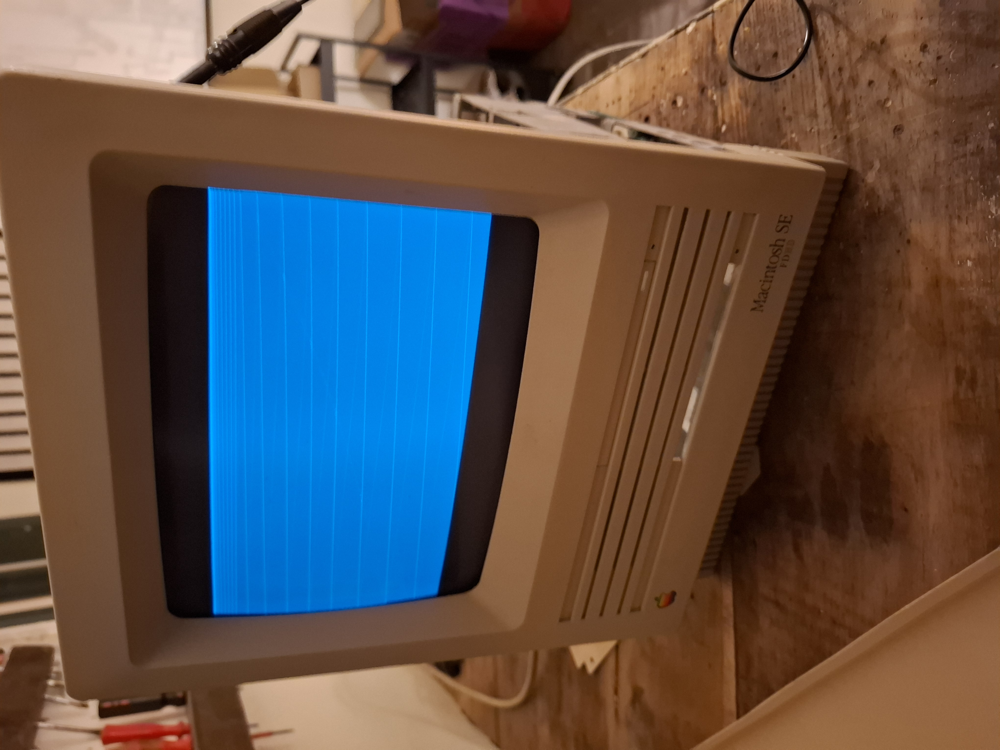
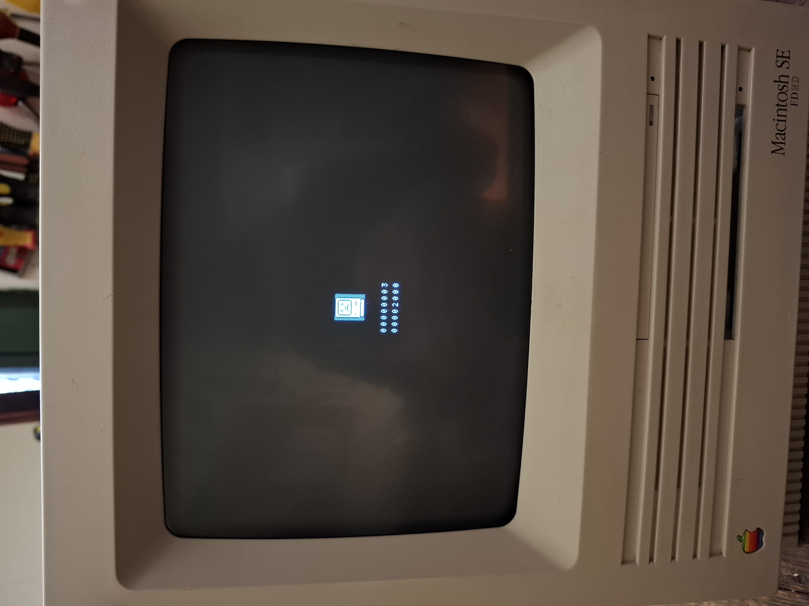

# Macintosh SE FDHD repair
February 2026

## Initial condition
Fan spins but no startup chime, display or drive activity. 5V and 12V rails are present at floppy connector.
## CRT
Upon disassembly, it was noticed that the glass was broken at the neckboard. The CRT was replaced.

## Analog board
There was still no display activity with the new CRT. The high voltage was also missing. The pad of C9 (1000uF 16V) showed some corrosion. The capacitor was leaking and was replaced.

The unit now showed diagonal lines. Many causes were explored, but the real cause was the lack of video signal coming from the logic board. The diagonal lines were simply due to a wrong cutoff setting.

## Digital board
There was significant corrosion around the axial electrolytics. All caps were desoldered, the board was cleaned in IPA, and new caps were installed. The sockets were also cleaned, and the battery was replaced.

The lack of video signal was caused by some cold solder joints around the video connector. All joint were reflowed, and the display presented a diagnostic screen. The error code indicated a memory error.

Cleaning the RAM slots had no effect. New memory was purchased, and the flashing floppy appeared with mouse cursor.

## PSU
The power supply was recapped. All capacitors were within tolerance.
## BlueSCSI
With the unit working and adjusted, a BlueSCSI emulator was used as a boot medium with System 6.0.8.
