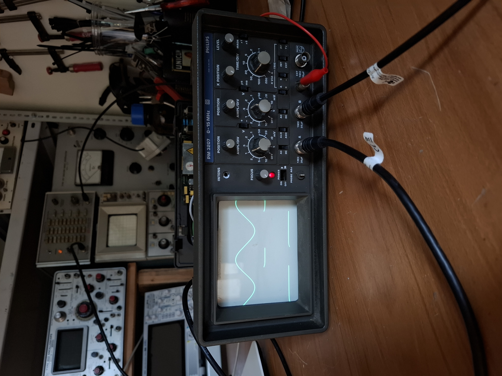
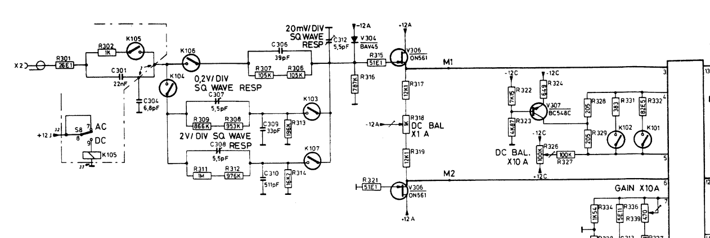
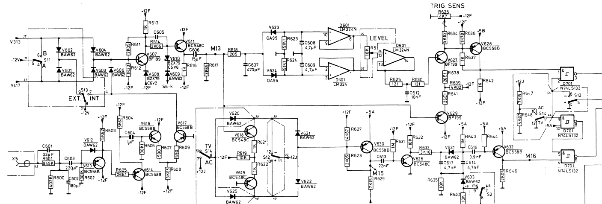

# Philips PM3207 cathode ray oscilloscope repair
May 2025

## Initial condition
Channel A is missing, channel B works fine. Timebase sweeps fine, trigger is not working. Channel B vertical position potentiometer has no effect

## Vertical position
The pin headers connecting the main board to the control board had a few bent/broken pins. Pin headers were replaced, vertical position controls work normally.

## Channel A

A test signal was connected to the input. The signal was traced through input attenuation, but turned into a large negative voltage after going through some large value resistors before the preamplifier. The culprit was V304 (BAY45), which conducted the -12V supply into the signal path and through to the preamplifier.

## Trigger

The trigger pick-off circuitry correctly feeds the level detector, but the signal doesn't reach the comparator. The issue was D601 (LM324), which amplifies the level signal and feeds it to the comparator.

